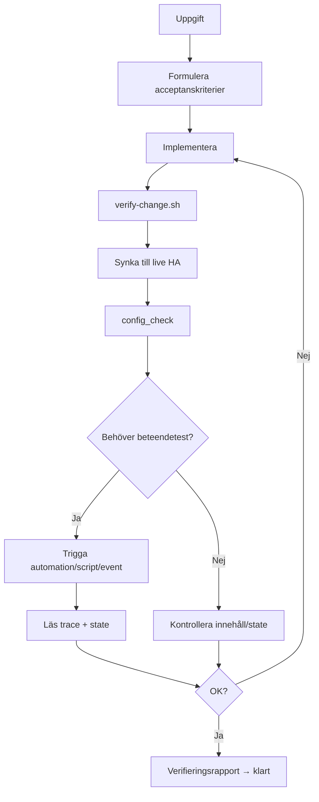

# Verifiering och test

Det här dokumentet beskriver hur vi säkerställer att ändringar i Home Assistant-projektet faktiskt gör det vi kommit överens om — innan någon säger "klart".

## Problemet

Home Assistant-konfiguration är ofta *nästan* rätt: YAML laddar, automationen triggas, men ett villkor missar, en template returnerar `false` tyst, eller fel entitet används. Syntaxkontroll räcker inte.

## Vad som går att testa

| Nivå | Vad | Hur |
|------|-----|-----|
| **Statisk** | YAML-syntax, inga hemligheter i git, HA YAML-regler | `scripts/verify-change.sh`, `scripts/check-ha-yaml.py`, `scripts/pre-commit-check.sh` |
| **Config** | Hela konfigurationen är giltig | `ha_get_system_health(include="config_check")` via MCP, eller REST `POST /api/config/core/check_config` |
| **Innehåll** | Rätt automation/script finns live | `ha_config_get_automation`, `ha_config_get_script`, `ha_search` |
| **Template** | Uttryck ger rätt värde med nuvarande state | `ha_eval_template` |
| **Beteende** | Trigger → villkor → åtgärder | Trigga + `ha_get_automation_traces` |
| **Slutläge** | Entiteter hamnar rätt | `ha_get_state` före/efter |

## Vad som *inte* går att simulera helt offline

- Tid, soluppgång, kalender och schematriggers utan att vänta eller mocka tid i HA
- Fysiska knappar, rörelsesensorer, WhatsApp-meddelanden från riktiga telefoner
- Sidoeffekter på skarpa enheter utan att faktiskt påverka dem

Därför bygger vi på **live-verifiering via MCP** (Nabu Casa) kombinerat med säkra testtriggers.

## Arbetsflöde för agenter (och dig)



### 1. Acceptanskriterier

Skriv 1–3 meningar om förväntat beteende *innan* eller direkt efter ändringen. Det gör "nästan rätt" mätbart.

### 2. Statisk kontroll

```bash
bash scripts/verify-change.sh
```

Kör YAML-syntax, HA YAML-validering (`check-ha-yaml.py`), säkerhetskontroll och (om `.env` finns) `config_check` mot live HA.

### 3. Deploy

Efter git-push: synka enligt [cursor-cloud-git-synk.md](cursor-cloud-git-synk.md), eller använd `ha_config_set_automation` för snabbare UI-test.

### 4. Funktionstest via MCP

**Automation med event-trigger:**

```
ha_call_event(event_type="whatsapp_message_received", data={...})
ha_get_automation_traces("automation.whatsapp_chatta_med_assist", limit=1)
```

**Automation/script direkt:**

```
ha_call_service("automation", "trigger", entity_id="automation.xxx", data={"skip_condition": true})
```

**Template:**

```
ha_eval_template("{{ states('sensor.temp') | float(0) > 20 }}")
```

**Trace visar** vilka villkor som passerade, vilken gren i `choose` som kördes, och eventuella fel — det är det närmaste en "simulation" vi har i HA.

### 5. Verifieringsrapport

Agenten ska alltid avsluta med en kort rapport (se `.cursor/rules/verifiera-fore-klart.mdc`).

## Tips för mer testbara automationer

- Lägg till `input_boolean.testlage` som villkor — slå på vid test, av efteråt
- Använd `event`-triggers med tydliga `event_type` som går att avfyra med `ha_call_event`
- Undvik template i `condition:` när native `state` / `numeric_state` räcker — de syns tydligare i trace
- Separera "skicka notifiering" i ett script så notifieringar kan testas isolerat

## Befintliga verktyg i repot

| Skript | Syfte |
|--------|--------|
| `scripts/check-ha-yaml.py` | State-trigger-konflikter, duplicerade id (offline, blockerar) |
| `scripts/audit-ha-yaml.py` | Bredare granskning — rapporterar utan att ändra |
| `scripts/check-ha-live.py` | Post-deploy: unavailable automationer + repairs (REST/WS) |
| `scripts/verify-change.sh` | Samlad kontroll före deploy (`--post-deploy` efter synk) |
| `scripts/pre-commit-check.sh` | Blockera känsliga filer i git |
| `scripts/check-template-states.py` | Template-entiteter inte `unavailable` |
| `scripts/compare-automations.py` | Diff mellan två automations.yaml |
| `scripts/verify-ha-mcp.sh` | MCP/REST-anslutning fungerar |

## Valideringslager (vad fångar vad)

| Lager | När | Fångar | Missar |
|-------|-----|--------|--------|
| **YAML-syntax** | Offline, pre-deploy | Ogiltig YAML | Semantiska HA-fel |
| **check-ha-yaml.py** | Offline, pre-deploy | `from`+`not_from`, duplicerade id, legacy trigger-syntax | Template-logik, saknade entiteter |
| **audit-ha-yaml.py** | Offline, granskning | choose-as-condition, entity_id script.*, mixed action/keys | Service-anrop, runtime |
| **config_check** | Live, post-deploy | Kärnkonfig, integrationer | Enskilda automationer med ogiltiga triggers |
| **check-ha-live.py** | Live, post-deploy | `unavailable` automationer, repairs (error+) | Template-fel, beteende |
| **repairs** (MCP) | Live, post-deploy | Samma som check-ha-live repairs | Fel som inte registreras som repair |
| **Beteendetest** | Live | Faktiskt flöde (trace) | Edge cases utan testtrigger |

Utöka `scripts/lib/ha_yaml_checks.py` (`CHECKS`) när samma typ av fel återkommer — mönster: strukturell regel som HA dokumenterar men som syntaxkontroll inte ser.

## Cursor-regel

Projektregeln `.cursor/rules/verifiera-fore-klart.mdc` gör detta obligatoriskt för alla agenter i det här repot.
